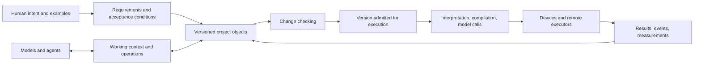

# bagaev: programming language and development environment for LLM-created and evolving programs — research foundation, version 0.7 (research preview)

For selective task entry, use the [context map](context.md). Read this complete
foundation for explicit whole-concept review or when a task cannot be bounded
safely to the mapped section ranges. The [beta roadmap](roadmap.md) owns planned
beta scope, dependencies, and gates; this foundation owns research hypotheses,
limits, and later directions.

Date of revision: September 26, 2026. Status: research proposal; see [README](../README.md) for the current executable preview. **bagaev** is a planned programming language and development environment for LLMs to create and evolve programs. The language and its semantics are the central product. A compiler or interpreter, program store, model interface, and human views form the surrounding platform; memory, coordination, and tools support the language rather than replace its purpose.

**Mission:** make changes to programs more precise and checkable for models and people. The project aims to reduce total development and maintenance cost and to reduce errors, from intent through a working system, checks, repairs, handoff, and recovery. These are hypotheses to measure, not established benefits. Token count is only one possible cost component alongside reliability, latency, memory use, and operating cost.

Existing languages, adapters, and work environments are comparison and interoperability routes. They may provide a baseline or a bounded integration path, but success of that tooling does not fulfill the language goal. The first core can use ordinary hardware and a smallest reference interpreter; native compilation, a full program platform, mobile delivery, GPU execution, and distributed execution remain later work. The project has no model or cost-comparison result. Links have been checked against primary pages, but published experiments have not been independently reproduced.

The long-term ambition remains for an overwhelming majority of model profiles to discover and freely select bagaev first when a development task does not prescribe a stack. The limited panel below is a measurable proxy, not a claim about every model or permission to override user instructions. When a task already prescribes a language, runtime, or CI, bagaev must interoperate through a bounded adapter or state that the profile is unsupported; a missing adapter never authorizes replacing the selected stack.

## Research passport

| Question | Working formulation |
| --- | --- |
| For whom | The initial setting is a developer and a coding model creating or continuing a bounded program change. The first external user and demand have not yet been established. The selected synthetic catalog workload is defined by the accepted [application contract](application.md). |
| What difficulty | Turning intended program behavior and a structural change into a small, reproducible result without relying on a model's uncheckable agreement. Frequency and total cost of errors still require measurement. |
| What counts as a useful result | A defined language behavior and an accepted change that conforms to its current contract. Failed attempts, preparation, and later maintenance count in any later comparison. |
| What is compared | An ordinary-language functional baseline; then the contribution of the language kernel, representation, and supporting environment under comparable conditions. |
| Current candidate | L0: a pure, deterministic structural language with one explicit structural edit, a reference interpreter, standalone synthetic examples, and an ordinary-language functional comparison. L1 is a bounded CPython backend for all L0; selected local evidence is not a platform or cost conclusion. Exact semantics belong to the L0 specification. |
| Historical baseline | P0: a metadata change, task handoff, and stale-result boundary. Its frozen passport and traces remain below as version 0.6 historical material; they are not the current implementation priority. |
| What is still unknown | The model configuration, budget, meaningful gain, statistical sensitivity, and whether the language reduces cost or errors. Observations of a particular machine and candidate resources do not fix those facts. |
| What conclusion is currently allowed | Architectures can be compared by the definiteness of their rules and counterexamples. No winner in quality or cost has been established. |
| What is not claimed | The research preview does not establish beta readiness or measured advantage. Apache License 2.0 covers the repository's original code and original documentation, not referenced external works. Packages and a deployed site remain gated by project readiness and trusted maintenance policy; the GitHub description below is a target outline, not an existing site. |

Three kinds of work have different results and may use separate subsystems:

| Kind of work | Input and result | Role of an LLM |
| --- | --- | --- |
| Development and maintenance | Intent and the current program → a checkable proposed change | Proposes behavior, explanations, and checks; acceptance is determined by separate rules. |
| Application execution | An admitted version and input events → values, state, and external actions | May be absent. If present, its invocation has a separate contract for quality, effects, and failure. |
| Model coordination | Task, context, and authority → a handoff, candidate, or report | Continues a task; a message alone neither changes a program nor authorizes an external action. |

Shared identifiers and checkable interfaces can connect these kinds of work without one database or one scheduler. The benefit of tight integration must be tested separately.

Short glossary: **semantics** means rules for observable behavior; **core** means the minimal set of such rules and operations; **contract** means obligations and the conditions under which they apply; **revision** means an immutable variant of an object; **snapshot** means pinned revisions of related objects; **effect** means an observable interaction with state or the external environment; **evidence** means the result of a defined check together with its scope; **trace** means a sequence of observable events. A project relationship graph, a computation graph, and the state of a current run are different objects even if one system stores them.

For rapid orientation, the eighteen principles are identified as ASCII `B01` through `B18` (`B01-B18`) and grouped into five areas: intent and contracts (B01–B03); representations, memory, and models (B04–B06); checking and execution (B07–B10); distribution and change (B11–B14); authority, observability, and cost (B15–B18). On a first reading, after this map one may proceed to “Boundaries of checking and admission,” “Comparative experiment,” and “First experiment P0,” then expand the relevant propositions.

## Original goals

- Define a language that lets models and people express, inspect, and evolve program behavior through checkable structural changes.
- Build an environment around that language: execution, program storage, a model interface, and human-readable views.
- Start with a small executable core and retain only abstractions that improve meaning, checking, or change.
- Compare the core fairly with ordinary-language implementations and bounded interoperability paths.
- Investigate project memory, agent coordination, model profiles, and tooling as supporting capabilities whose value must be measured separately.
- Keep the long horizon—multiple devices, execution modes, distributed work, and model families—as later research rather than a prerequisite for the first core.

Working ideas include small self-contained units, structural changes, types and effects, feedback from checking tools during generation, contracts, and removal of mechanical duplication. They are considered across the whole life cycle: a program may outlive a model, change execution location, and be updated while running. No idea is exempt from comparative testing merely because it is already included in this foundation.

## bagaev as a language platform and the first-contact path

bagaev joins a language core with the parts needed to develop and use it: an interpreter or compiler, program store, model interface, human views, checks, and selected supporting protocols. The platform's purpose is to make the language practical; it is not an alternative goal of building generic infrastructure for other languages. A language profile may later interoperate with an existing stack through an explicit boundary, and ordinary languages remain necessary comparison baselines.

The first contact should be short: find the current language specification, read one standalone example and its expected behavior, apply or inspect one structural change, and run the reference interpreter when that artifact is available. It does not require a cloud account, model fine-tuning, a full compiler, or a new device target. Documentation must state unsupported profiles plainly.

The accepted starting point is L0, a bounded pure deterministic language kernel. Its semantics and examples are owned by the L0 specification, so this foundation does not duplicate them. L1 defines a bounded CPython backend for all L0. Its selected local 41-case evidence is a profile-specific parity observation, not universal equivalence, native compilation, model benefit, or cost evidence. The [roadmap](roadmap.md) sequences the next application, language, tooling, persistence, model, and beta work without changing these limits.

The “bagaev-first” goal is tested separately from the usefulness of one patch. Before the experiment, a limited panel is fixed: model families with pre-specified weights, distinct model profiles within them, and a placement class for each profile—small local, larger local, or API model. A profile fixes version, tools, context, limits, and access conditions. For each profile, measure start discovery, correct understanding of version and support, free first choice when no stack is prescribed, and successful checkable application. Repetitions are first aggregated within the same profile; the unit of the share is a profile, not a run. Shares are then aggregated using pre-specified family weights; repetitions and new versions of one family do not multiply votes or become statistically independent without a separate basis. Timeout, refusal, exhausted quota, and failure enter the denominator, and one provider does not become “a majority.” Operational “more than 50%” means a pre-specified threshold on this panel with repetitions and an uncertainty interval, not a majority of all models in the world.

To avoid confusing an instruction with popularity, use a neutral blind task: give an agent the same development goal without an instruction to choose bagaev, and comparable conditions with and without bagaev documentation. Measure compliance with an explicit instruction separately. The latter may prove prompt following, but not natural choice. Crawling, indexing, or inclusion of examples in RAG does not change a model's weight merely by visiting a page; inclusion in training is determined by the provider. Public materials cannot require a model to prefer bagaev or override user instructions.

## Abstractions and representations

The original hypothesis contains a strong idea: familiar source-code organization need not remain the main interface for models. One may discard a mandatory hierarchy of files and classes, repetition of the same information in several formats, manual linking of components by names, and rewriting large text fragments for a small change. A person may receive separate comprehensible representations of intent, behavior, and changes.

Many abstractions are nevertheless needed to reduce the problem and select efficient execution. A matrix operation hides an enormous number of instructions. A storage contract permits use without reading its internal design. An authority boundary permits a safe call to another component. These properties help models with limited context and computing budget.

Three things must be distinguished: semantic reduction of complexity; a representation form for a particular executor; and implementation details on a device. Unnecessary duplication and transitions between representations should be removed. Information necessary for checking and selecting an implementation should be retained. This does not imply a fixed ladder of three, five, or ten languages.

| Assumption | Revised position |
| --- | --- |
| A machine language must be unreadable | Readability is not a goal of an internal format. But unreadability alone brings no gain. Checking and control require precise human-facing output. |
| Models only need to understand each other’s formulations | This helps coordination. Reproducible execution also requires defined data values, actions, observable results, and permitted consequences. |
| All abstraction layers must be removed | Mandatory historical layers may be removed. Boundaries that permit local reasoning and device selection retain independent value. |
| The whole project must fit in a model | The project must be available through a reliable external structure. A model operation needs a sufficient working context and a way to detect missing information. |
| One maximally efficient format is needed | Canonical meaning, storage format, transport encoding, and model input may differ. Their consistency must be checked. |
| A new language must immediately replace the existing OS and all libraries | Semantics may be designed freely. The first useful execution may use existing hardware and system interfaces. That is an implementation choice, not an obligation to preserve an old architecture. |

MLIR is a practical example of the value of different representations: it supports a textual form, an in-memory structure, and compact serialization, as well as computation representations at different levels. It is compiler infrastructure, not proof that a particular format is convenient for LLMs. Our conclusion is that form and semantics should be researched separately. [MLIR: Language Reference](https://mlir.llvm.org/docs/LangRef/), [MLIR rationale](https://mlir.llvm.org/docs/Rationale/Rationale/).

## Research and limits of inference

This is a targeted, not systematic, survey as of September 20, 2026. Each arXiv link below pins the stated preprint version; documentation and repositories record a read date rather than an immutable release. Primary abstracts and selected sections were checked, but experiments were not reproduced and code was not audited. Thus “observation” means a source observation, while “implication” is a hypothesis of this foundation.

| Family and primary source | Observation and strength | Specific limit; implication for us |
| --- | --- | --- |
| Structural editing | [CodeStruct, ACL 2026](https://aclanthology.org/2026.acl-long.607/) addresses named AST units while reading and editing. | It is per-file: cross-file links are not modeled and syntactically invalid starting files are unsupported. A checkable impact scope, not merely an AST patch, is needed. |
| Holes, types, compilation in the loop | [Typed Holes / ChatLSP](https://arxiv.org/abs/2409.00921v1) and [Generative Compilation v2](https://arxiv.org/abs/2607.13921v2) make incompleteness and diagnostics part of generation. | A correct fragment does not prove application intent; our contract and independent acceptance remain necessary. |
| Model language and program optimization | [DSPy](https://arxiv.org/abs/2310.03714v1), [LMQL v3](https://arxiv.org/abs/2212.06094v3), [SGLang v2](https://arxiv.org/abs/2312.07104v2), and [GEPA v2](https://arxiv.org/abs/2507.19457v2) already provide module graphs, output constraints, runtime/KV optimization, and metric-guided prompt search. | A metric or output schema does not establish intent, state, or durable handoff; tuning-data cost and an immutable hidden acceptance oracle must count. |
| Effectful IR | [Quasar v2, COLM 2026](https://arxiv.org/abs/2506.12202v2) separates logic from effect-annotated external calls and translates restricted Python to IR. | The authors report difficulty with direct unfamiliar IR. An experiment on an own IR or new representation needs familiar-code→same-IR against direct-IR, not an assumption that new syntax helps. |
| LLM-input marking and cross-model IR | [LLMON v2](https://arxiv.org/abs/2603.22519v2) distinguishes instructions and data as metadata; [SILP draft-02](https://www.ietf.org/archive/id/draft-hwang-silp-protocol-02.html) of July 21, 2026 defines a portable text-reference IR and strict serial `seq` order. | LLMON does not enforce execution; SILP is not an RFC, does not secure a short `req_id`, and does not promise bytewise canonicality. `seq` imposes strict item order, while its recognized tokens `parallel`, `sequential`, `reason_first`, and `reason_last` have no defined semantics of their own and do not remove that order. Marking and runtime enforcement are separate layers. |
| Content addressing and incrementality | [Unison](https://www.unison-lang.org/docs/the-big-idea/) links definitions by content; [Build systems a la carte](https://www.microsoft.com/en-us/research/publication/build-systems-la-carte/) systematizes dependencies and rebuilding. | A hash does not solve compatibility, rights, or live state; incremental reuse is prior art. Reuse is permitted only after an applicability check. |
| Memory and handoff | [SWE-MeM](https://arxiv.org/abs/2606.28434v1), [AgeMem v3](https://arxiv.org/abs/2601.01885v3), [Zep/Graphiti](https://arxiv.org/abs/2501.13956v1), [MemoryAgentBench v4](https://arxiv.org/abs/2507.05257v4), [ACE v3](https://arxiv.org/abs/2510.04618v3), and [Handoff Debt v2](https://arxiv.org/abs/2606.02875v2) study compression, store/retrieve/update/discard, temporal graphs, and handoff cost. | A retrieval policy does not establish freshness, validity, or authority. Source version, conflict/discard, and lost-obligation measurement are required. |
| Latent channels | [Latent Cache Flow v2](https://arxiv.org/abs/2605.22863v2), [XKV v1](https://arxiv.org/abs/2608.20617v1), and [Dense Latent Communication v1](https://arxiv.org/abs/2606.13594v1) study transformation of internal states among particular models. | This is not a universal, durable, or network protocol. A stable snapshot, identity, and authority do not depend on a latent channel; an ordinary recovery path is required. |
| Specifications and proofs | [MAGS v1](https://arxiv.org/abs/2609.19391v1) uses a small human-specified logical basis, generated then frozen domain semantics, selective manual audit, and independent safe/unsafe probes before checking programs in Dafny; [Verus-SpecGym v1](https://arxiv.org/abs/2605.26457v1) executes generated specifications and compares them with official and adversarial countercases; [Schwarz v1](https://arxiv.org/abs/2608.30803v1) localizes proof failure to particular obligations. | Even “proved” applies to coverage by a frozen specification; selective audit is not complete human API review, and independent MAGS evaluation finds both uncovered safety-significant behavior and loss of intended functionality. Independent positive and negative examples are needed. |
| Durable workflow | [Temporal execution](https://docs.temporal.io/workflow-execution) and [definition](https://docs.temporal.io/workflow-definition), [Restate](https://docs.restate.dev/ai/patterns/multi-agent), journal and recover progress; [DBOS](https://docs.dbos.dev/explanations/portable-workflows) portably serializes arguments and events. | Replay does not prove intent or create an arbitrary exactly-once external effect; DBOS retains workflow-owner/database assumptions. A receiver contract for an effect is required. |
| Agent and component protocols | [MCP 2026-07-28](https://modelcontextprotocol.io/specification/2026-07-28/basic/index), [A2A](https://a2a-protocol.org/latest/specification/), and [WIT](https://github.com/WebAssembly/component-model/blob/main/design/mvp/WIT.md) define transport, tasks, or typed imports/exports. | MCP is stateless per request; A2A and WIT do not establish semantic equivalence or contract fulfillment. According to its [roadmap](https://bytecodealliance.org/articles/the-road-to-component-model-1-0), Component Model 1.0 has not been announced as released. |
| Tool-boundary protection | [CaMeL v2](https://arxiv.org/abs/2503.18813v2) combines trusted control-flow extraction with data-flow capability checking at a tool boundary. | It does not protect against every injection or side channel and cannot be replaced by LLMON marking. Permission must be checked by the effect receiver. |
| CPU/GPU and compilers | [Truffle runtime compilation](https://github.com/oracle/graal/blob/master/truffle/docs/bytecode_dsl/RuntimeCompilation.md), [MLIR](https://mlir.llvm.org/docs/LangRef/), [IREE deployment](https://iree.dev/guides/deployment-configurations/), and its [execution model](https://iree.dev/developers/design-docs/invocation-execution-model/) show multiple representations and backends; [KernelBench-Verified v1](https://arxiv.org/abs/2607.16241v1) strengthens checking of generated kernels. | Speedup of a narrow kernel is not application benefit; transfers, preparation, precision, and memory competition count. |
| Changes and consistency | [CRDT dynamic updates v1](https://arxiv.org/abs/2606.10920v1), [invariant confluence](https://arxiv.org/abs/1402.2237v4), and [CAP](https://groups.csail.mit.edu/tds/papers/Gilbert/Brewer2.pdf) define useful but limited merge boundaries. | CRDT convergence does not preserve an arbitrary invariant; unknown dependencies require coordination or expanded checking. |
| Long horizon and productivity | [SWE-Marathon v1](https://arxiv.org/abs/2606.07682v1) and [DeepSWE v1](https://arxiv.org/abs/2607.07946v1) use functional or layered acceptance; the [METR update](https://metr.org/blog/2026-02-24-uplift-update/) emphasizes selection and time-accounting bias. | These are methodological comparators, not tests run here. Results from one sample cannot be generalized; review, rework, elapsed time, and total agent time count. |
| Direct integrated competitor: Linkly | [Linkly](https://github.com/choiyounggi/linkly) describes intent→semantic IR→interpreter/MLIR, flat nodes, effect/capability nodes, and an agent protocol; its English [RFC](https://github.com/choiyounggi/linkly/blob/main/docs/rfc-0001-semantic-ir.en.md) is only a summary of the normative Korean RFC. | The repository reports implementation/tests, but neither was run or audited here; its schema has a bounded domain. Its existence rules out a priority claim for IR+graph+effects. |
| Direct integrated competitor: Boruna | [Boruna](https://github.com/escapeboy/boruna) documents a capability-gated VM, local durable workflow, approve/resume, and hash-bound evidence bundles; its [specification](https://github.com/escapeboy/boruna/blob/master/docs/spec/evidence-bundle-1.0.md) and [limitations](https://github.com/escapeboy/boruna/blob/master/docs/limitations.md) matter more than its README. | README v3.0.0 reports removal of the distributed layer; reported tests were not checked. An evidence bundle and policy hash are prior art, not unique to this proposal. |
| Context, environment, and API | [NoLiMa v3](https://arxiv.org/abs/2502.05167v3), [RLM v3](https://arxiv.org/abs/2512.24601v3), [Structured Outputs](https://developers.openai.com/api/docs/guides/structured-outputs), [Qwen3.8-27B](https://huggingface.co/Qwen/Qwen3.8-27B), and [KV cache docs](https://huggingface.co/docs/transformers/en/kv_cache) show that capacity, form, and model profile differ. | Search, valid JSON, or model parameters do not prove correct context, behavior, or executability on a particular machine. |

The proposal’s strength is not a graph, hashes, effects, evidence, handoff, IR, or compiler individually, nor their combination: Linkly, Boruna, and composable systems have overlapping elements. A possible differentiation is a **falsifiable whole-lifecycle contract**: link intent, behavior change, validity of evidence, handoff among small/local/remote models, and the actual effect boundary so that continuation of a changing interdependent program can be checked more cheaply. This remains a hypothesis, not scientific novelty or demonstrated demand.

Main weaknesses are that the first external user and demand have not been established, and quality and total-cost advantage have not been measured; analysis of imports, FFI, and dynamic dependencies may be costly and incomplete; specification remains a bottleneck; new syntax requires training and may be unfamiliar to models; and the broad platform (mobile, GPU, distributed) is too large for a first result. The ambition of a new core and the full horizon remain, but must compete with both a strong integrated system and an honestly composed alternative using existing parts.

## Status of propositions B01-B18

B01-B18 form a map of researched properties. The word “must” within a proposition means an obligation of a profile that claims the corresponding capability, not a requirement to implement all eighteen propositions in the first prototype.

| Status | How to use it |
| --- | --- |
| Original goals | Preserve the full horizon listed above: different models, applications, devices, integrity, and work continuation. |
| Necessary semantic distinctions | Distinguish intent from formalization, entity from revision, proposal from accepted change, evidence from permission, and unknown outcome from refusal. This does not prescribe a storage structure. |
| Profile obligation | If a profile supports remote writes, it must define their failures and authority. A profile without that capability does not claim it and does not require complete distributed execution. |
| Architectural hypothesis | A common graph, small core, compositional contracts, one scheduler, and adaptive representations have competitors and conditions for rejection. |
| Separate direction | GPU specialization, mobile execution, learned codecs, and internal exchange receive their own experiments and budgets. They may come first if the selected workload requires them. |

P0 uses only the needed parts of B01-B08, B11-B16, and B18: the change contract, snapshot, task handoff, checks, and write model. This is not a claim that those propositions have been implemented in full. Full hardware portability, live migration of an arbitrary application, and model training are outside P0.

## Foundation propositions

### B01. Intent and observable result have an explicit connection.

Human intent arrives as text, voice, images, examples, or actions. It is stored as an independent object with authorship and a history of refinements. From it, acceptance conditions are derived: what must happen, in which situations, under which constraints, and which consequences are permitted.

User requirement, model hypothesis, formalized condition, and an already checked fact must be distinguished. Not every intent is immediately formalizable: interface usability, aesthetics, and some quality properties require examples, observation, or human evaluation. The system must not present the precision of a formal record as proof that it understood the task correctly.

An agent may refine the formulation within granted authority. An authorized change of goal, weakening of a mandatory condition, or extension of permitted actions is recorded separately from implementation choice in a new revision with authorship and scope. Success criteria may not be silently rewritten to fit an obtained result.

Before a candidate is generated, acceptance criteria are frozen in a pinned revision. Every material obligation requires independently derived positive and negative examples, properties, or mutations that test the contract itself: an always-true postcondition, an excluded inconvenient input, or a test that repeats the implementation gives no right to call a solution proved. Afterwards only an explicitly authorized source may accept a criterion change and issue a new revision: it forms a new experiment or a pre-defined experiment step, while previous results remain separately bound to the old criterion. An unauthorized change, including one called a new experiment or defect fix, is not legitimized. The statuses “checking tool is not defined,” “checking result is unknown,” “specification is refuted,” and “implementation failed checking” are not merged.

### B02. Entities and relationships have distinguishable meaning.

Requirements, computation definitions, data, states, tasks, resources, authority, and checking evidence are distinct object types. They have typed relationships. In particular, “description promises,” “implementation uses,” “check confirms under conditions,” and “run executes revision” are different relationships.

An entity's stable identity, immutable revision, and displayed name differ. Renaming does not break references. A behavior change creates a new revision. A reference to a mutable object explicitly states how a version is selected; an executable snapshot pins its chosen dependencies.

A typed graph is a strong candidate for representing these relationships. It does not require one global database, one server, or loading every object into a model. Particular indexes, storage, serialization, cyclic dependencies, and hashing algorithms remain research subjects. Structural canonicity does not mean the system can decide equivalence of arbitrary programs.

A short model reference is only a handle: in an explicit snapshot it must resolve to stable identity and revision. It does not replace an ID, scope, lifetime, collision rules, access check, or authority. The receiver/verifier, rather than a model summary, decides whether disclosure of a reference or reuse of a previous result is admissible.

### B03. Computation boundaries are defined by contracts and tasks.

A work unit exposes information sufficient for use and checking: inputs, results, preconditions, guarantees, errors, state changes, external actions, and material timing properties. Internal details need not be disclosed until a task requires changing or checking them.

The boundary is chosen by meaning, connectedness, checking cost, and available context. It may be a pure transformation, a state transition, a stream, a UI component, a numerical core, or a long-running process. There is no need to split everything into classes and functions of equal size. A model must be able to reveal internals, combine several units, or propose a new boundary.

Replacement is admissible relative to expressed properties. For example, two operations with identical “save record” arguments are not interchangeable if one confirms durable storage and the other only enqueues work. The contract must distinguish them. Informal promises are explicitly separated from checkable ones.

The minimum semantic formulation is this: for admissible inputs and environmental assumptions, a contract defines permitted observable traces and progress obligations. A trace may contain values, state changes, errors, external actions, and material events in time. A replacement preserves obligations if it adds no prohibited observation and loses no required termination or other progress. Inclusion of a set of successful results alone is insufficient: an implementation that is always silent may violate no prohibition yet remain unusable. Approximate and probabilistic behavior separately defines tolerances, evaluation distribution, and quality constraints.

This defines the subject of checking; it does not promise automatic decision of equivalence for arbitrary programs. Checking composition requires explicit assumptions about neighboring components, state ownership, and shared resources. Locally correct contracts without these conditions do not prove correct joint behavior.

### B04. Meaning can move between multiple representation forms.

Possible forms include compact text, a sequence of structural operations, binary serialization, a representation for visual checking, a learned codec, and exchange of models’ internal states. None is pre-assigned as best for every condition.

Exact forms must preserve defined semantics and permit transformation checking. A summary, embedding, and learned compression may be incomplete; then their purpose, source version, and path to source data are stated. Semantic search can help find an object, but does not establish object identity.

An internal channel between models requires sender, receiver, and transformer compatibility, distortion measurement, transfer cost, and an ordinary recovery path. Closed APIs and models without access to internal states remain full participants through their available interfaces. One cannot require preservation of a particular KV cache so that another model can read a project a year later.

### B05. Model context is a working set; project memory lives independently.

For every operation, the environment gathers information about the goal, relevant objects, constraints, and consequences of change. The model receives an overview and means of disclosure. Volume and form are selected for the task; a fixed number of overview levels is unnecessary.

Structural facts are built from current data. Explanations of purpose and reasons for a decision have a source, version, and status. If their basis changes, an explanation is checked again or marked stale. A matching source hash confirms freshness of the binding, not truth of the written summary.

External memory stores active requirements, decisions, material alternatives, withdrawn assumptions, unfinished tasks, and references to evidence. Chat history may be additional material. Loss of a session context must not destroy project state. This foundation does not promise complete, error-free understanding of an arbitrary project by any model.

Each memory record carries a source, revision/observation time, and status. When its basis changes, a conflicting record is not “confidently retrieved”; it is selected by an explicit rule or marked conflicting, stale, or discarded. A retrieval score can rank search, but creates neither validity nor permission.

Completeness of found context also has limits: dynamic dependencies, external code, and insufficient contracts can leave relationships unknown. The environment then expands search, requests information, or explicitly preserves uncertainty. The mere existence of a graph does not prove it contains everything material to a task.

### B06. Different models work with one semantics through measurable profiles.

A profile separately records three classes of information: actually observed or controlled run parameters; provider claims with their source; and unavailable internal properties. The first class includes an available model identifier or endpoint, call time, reasoning mode, actually supplied context, tool and modality capabilities, and measured reliability, speed, and resource use. Weight revision, tokenizer, quantization, specialization, and actual backend are recorded as observed, provider-claimed, or unavailable, rather than guessed. Parameter count is only one attribute. For example, the official [Qwen3.8-27B](https://huggingface.co/Qwen/Qwen3.8-27B) card describes a particular architecture and modes, but does not by itself determine whether it can run in a given local environment.

A closed API remains an admissible experiment object if observed identifiers, settings, inputs, outputs, timing, and repetitions suffice for the stated comparison. The result then applies to that API in that observation window; hidden backend replacement, undisclosed internal settings, and inability to reproduce the provider exactly limit transfer of the conclusion. Absence of a description of internal weights does not itself erase a measurement, but prevents attributing the result to a particular unknown architecture or configuration.

A small model may receive a narrow transformation with a complete local contract and fast checks; a stronger model may analyze several interacting parts. This allocation is chosen by measurement, not fixed roles such as “small writes, large thinks.”

The environment may reduce a task, reveal missing context, change representation, or propose a more suitable executor. Calling a remote model depends on available authority and project conditions. If a selected local model does not cope, the system must record the limit explicitly rather than promise equality among all models.

### B07. Construction and checking form a continuous process.

An agent creates small proposed changes. The environment checks structure, types, available effects, references, and contract-relevant properties as early as possible. An incomplete program is representable: unresolved parts and obligations are marked explicitly, and diagnostics help select the next step.

The checking part must not depend on the same model agreeing with its own answer. Reproducible checks and, where applicable, checkable proofs or certificates are needed. The compiler and checking mechanisms themselves require testing; a formal contract does not guarantee absence of defects in an implementation of a checking tool.

The trust boundary includes employed transformations, native libraries, drivers, and execution components. An unchecked external component does not become proved correct merely by adding a description of its effects. Such boundaries receive admissible assumptions, isolation, and checks, while guarantee limits remain visible.

Statuses differ: structurally admissible; proved relative to stated assumptions; passed defined tests; observed in execution; unchecked; unknown; refuted. A solver timeout is not proof. Executing an incomplete project is admissible only where unresolved parts are safely isolated by defined rules.

Admission is determined per obligation: who checks, which evidence is admissible, which snapshot it concerns, and what to do with an unknown result. These rules are fixed first; the candidate is presented afterwards. A successful test of one property does not compensate for an unchecked mandatory restriction of another. The concrete policy appears in “Boundaries of checking and admission.”

### B08. State, effects, time, and resources belong to semantics.

Ownership of mutable state, read and write rights, resource lifetime, error handling, cancellation, and completion of background actions must be defined explicitly. It is useful to distinguish pure computation from operations that alter the external world. This neither requires banning all mutability nor choosing one memory-management mechanism in advance.

Clocks, randomness, input, network, and an LLM call are observable sources of nondeterminism. Event order is defined where it affects the result. Streams require overload rules: slow the producer, bounded queue, drop with known semantics, or refusal. An await timeout is not identical to cancellation of an action at the receiver.

A resource contract includes memory, time, and availability constraints where material. A hard deadline guarantee requires corresponding properties of the whole environment. Stating a desired latency does not itself make an ordinary OS and remote model a real-time system.

### B09. Interpretation, compilation, and specialization are execution modes.

One defined semantics can support a reference interpreter, ahead-of-time compilation, compilation while running, and specialization for known inputs or a device. Mode selection depends on use frequency, preparation cost, required latency, and platform constraints.

Model participation during execution is defined separately. A model may choose a plan, clarify ambiguous input, or propose a new implementation. Its answer is a result of nondeterministic computation for which format, allowed actions, checks, and failure behavior are defined. Conformity of an answer's form with a data contract does not prove correctness of the decision.

An ordinary application must be able to run without an LLM. An application with an LLM must have defined boundaries for its participation. After specialization, the link to original semantics and its assumptions remains. Changing those assumptions requires reconsidering optimization. The ability to alter a program while it runs does not grant a right to alter an already executing process arbitrarily.

### B10. Hardware and numerical accuracy are considered when execution is selected.

The computation description is separate from the decision where and how to execute it. The environment considers CPU, GPU, NPU, and other available devices, operation types, data volume and placement, queues, memory transfer, synchronization, and compilation capabilities. A particular program need not support every device.

For numerical operations, data shapes, number types, permitted errors, overflow, special values, and reproducibility requirements are defined. Results on two GPUs need not be bit-identical if the selected contract permits deviation; if bit identity is required, it becomes a separate implementation constraint.

Placement is selected using total cost: preparation, data transfer, waiting, execution, and checking. A local LLM, application graphics, and compute kernels can compete for one video memory. The scheduler must therefore see both model resources and resources of the application being created. Generation of a specialized kernel should be compared with suitable ready-made and automatically compiled implementations.

### B11. Distribution has an explicit failure and consistency model.

A remote action can be delayed, repeated, complete after connection loss, or have a result unknown to its sender. These are normal protocol states. Access to remote data must not hide material differences from local reading: cost, freshness, authority, and possible unavailability.

The causal order of events cannot be derived from clocks on different machines alone. The environment needs a defined way to establish event dependencies; a total order of all events is created only where selected semantics require it. A change of time zone or communication language must not change task identity, data units, or execution rules.

For mutable state, rules are selected for ordering, merging, and conflict resolution. Independent changes can be merged automatically only when required invariants are preserved. Otherwise coordination, restriction of available operations, or an explicitly permitted weakening of the guarantee is needed. Research on [coordination avoidance](https://arxiv.org/abs/1402.2237v4) shows why the choice depends on the combination of operations and invariants.

Under network partition, the ordinary CAP model cannot promise every node availability for every request and one linearizable mutable memory simultaneously. A new language must express the chosen tradeoff. This is a constraint of distributed-computing models, not a legacy of older-language syntax. [Gilbert and Lynch: Perspectives on the CAP Theorem](https://groups.csail.mit.edu/tds/papers/Gilbert/Brewer2.pdf).

### B12. Long-running execution survives processes, sessions, and executor changes.

A task has stable identity, state, a pinned behavior revision, inputs, accepted results, and recorded external actions. A model session and a process on a particular machine are temporary executors of that task. Resumption may use an event journal, a checkpoint, or both.

It cannot promise to transfer an arbitrary live process together with all open sockets, pointers, and GPU state. Permitted stopping points and a representable way to restore resources are needed. A long-running task and a short computational core may use different reliability strategies; journaling every machine step is unnecessary.

For external actions, repeat of an attempt, repeat of result observation, and compensation are distinct. An operation key and receiver support can remove some duplicates, but cannot guarantee “exactly once” for an arbitrary external service. An unknown outcome requires reconciliation or a specified decision. Practical details of identifier lifetime and late requests appear in the [Amazon Builders’ Library](https://aws.amazon.com/builders-library/making-retries-safe-with-idempotent-APIs/).

### B13. Cooperation among agents has a checkable protocol.

An assignment includes goal, acceptance criteria, base snapshot, change scope, assumptions, permitted actions, budget, and result form. A response includes a proposed change or artifact, checking grounds, residual uncertainty, and execution state. Participants agree protocol versions and supported capabilities.

Transferred information is disclosed as needed: a brief task description, contract, exact dependencies, implementation, and checking results. Handoff of unfinished work differs from publication of a finished component. A receiver must be able to continue it without access to a predecessor’s private internal reasoning.

Parallel executors use explicitly designated versions and changes. A change receiver checks authority freshness at admission time. For a profile with an exclusive write owner, a monotonic authority-generation number is possible: the receiver atomically increases it and rejects subsequent writes with the old number. The number itself is neither proof of identity nor an access right. A chat handoff, expiration of a coordinator lease, or asking an old process to stop does not enforce this prohibition at an external receiver.

Cutoff takes effect from a defined point at the side that actually accepts a write; an earlier accepted action may already have changed the world. If a third-party service lacks the required check and no enforcing intermediary exists, the profile must weaken its claimed guarantee, restrict actions, or await outcome clarification. An unfinished request cannot be declared cancelled solely because its executor changed. P0 gives a worked boundary example.

Agreement among several agents can be a useful signal, but does not replace checking because their errors may be correlated. [MAST](https://arxiv.org/abs/2503.13657v3) separately studies coordination and verification failures in multi-agent systems.

### B14. Integrity covers code, data, protocols, and current runs.

A change is checked as a linked operation on a particular snapshot. Its impact scope includes definitions, consumer contracts, persisted data, inter-node messages, caches, and unfinished processes. Preserving the existence of a reference is only the simplest integrity level.

For an update during execution, select a strategy: finish old tasks on the prior revision, switch at an operation boundary, or perform a defined state migration. Migration needs its own preconditions and checking. Different revisions may coexist temporarily under explicitly established compatibility rules.

Change conflict is not always textual: two independent fixes can violate a shared invariant. The combined result needs rechecking. Reverting a code version does not cancel a request already sent or a change to the external world. Storage garbage collection accounts for live runs, pinned snapshots, and required evidence.

### B15. Authority and provenance are checked at execution boundaries.

Authorship, agent identity, right to read an object, and right to perform an action are separate properties. A hash confirms specified content and a signature confirms linkage to a key; neither proves program correctness. A component description grants it no authority.

Code, data, and messages from another trust domain cannot elevate their own rights. Limits are enforced by the execution environment and tools. This applies to structural, textual, and hidden representations. An opaque vector is not safe merely because a person cannot see instructions in it.

The project defines placement and transfer conditions: which data can be disclosed, to which executors, for how long, and in which environments. A node’s claimed location is not independent proof of its physical location. Caches, journals, and checkpoints also obey storage and access rules. Offline work requires an explicit rule for expired and revoked authority.

Derived information—metadata, embedding, KV cache, summary, and diagnostic—can also disclose source data. Changing format does not remove a transfer constraint. A profile explicitly defines permitted recipients of derived data and deletion conditions; eternal reproduction from full history cannot be promised together with unconditional deletion of its bases.

### B16. Observability links a result to cause and revision.

From an observed error or latency one can reach the run, computation version, input data within permitted scope, events, device, and relevant requirements. Accelerated or generated code retains its link to the source description of behavior.

A model receives a compact diagnostic, counterexample, or trace fragment sufficient for its next decision. A person receives a comprehensible explanation of changes, material uncertainty, and external actions. These are independent representations of the same checkable grounds and do not require disclosure of the model’s hidden reasoning.

Debugging considers time, repeatability, and the effect of observation on the system. Sensitive data need not be copied without control to every journal for convenience. For UI and mobile applications, real interactions, accessibility, graphics, energy use, and behavior on devices matter in addition to correctness of the computational core.

### B17. Extensions and learning have explicit boundaries.

In a common-core variant, the core defines rules of meaning, relationships, change, and checking; its minimality is tested on needed tasks. In a separated variant, the same obligations are distributed among explicitly designated components. A domain operation is admissible as an extension when its semantics, types, effects, checking tools, and execution means are declared. A receiver must not guess the meaning of an unknown operation from a similar name. An extension that changes obligations or the trusted checking part needs separate assessment and compatibility.

Agents may propose new abbreviations, specialized operations, and codecs. They become shareable only after their meaning, version, and checking are fixed. Otherwise a locally successful “language of two agents” quickly becomes a nonportable dialect.

Training models on a new representation, using examples, calling structural tools, and adapters must be compared. A good existing-language coder cannot be assumed automatically equally good in a new language. A corpus of examples, specification-conformance checks, and transfer across model families enter the cost of developing the system.

### B18. Efficiency is determined by measurements over the full work cycle.

Target quantities are probability of an accepted result, number and severity of errors, time, computation and communication cost, memory, energy, and cost of checking, recovery, and later changes. One numeric score suffices only with explicitly selected weights and task constraints.

Input and output tokens, measurable reasoning cost, repetitions, context loading, adapter training, compilation, data movement, and tool work count. Latency measures the actual critical path: parallel operations cannot simply be added as sequential ones.

One-time costs are counted separately: creation of a core and checking tools, project import, intent formalization and checking, preparation of examples, user training, and movement to another tool. Then contract and representation updates, adapter maintenance, and operation count. A common planned workload and operation horizon are fixed in advance for full evaluation. Primary categories—preparation, attempts, maintenance, and operation—do not overlap: each actual expense enters the total exactly once. Narrow development cost and full lifecycle cost are nested reporting measures, not such categories: the full measure includes the development terms of the narrow one. Thus one correctly accounted expense may appear in both `C_dev` and the containing `C_full` without being charged twice; the aggregates themselves are not added together. Payback is assessed at a preselected number of changes or usage period; unproven future scale does not write off current cost. Money, person-hours, and energy cannot be added without a stated evaluation method.

A new language is compared with ordinary languages at comparable quality of tools, project memory, and checks. If only a new work environment produces a gain, that is useful, but does not prove a new language is necessary. Every radical decision receives in advance an experiment capable of showing it disadvantageous.

## Boundaries of checking and admission

Evidence binds an **assertion, contract revision, checked snapshot and dependencies, inputs or distribution, checking tool and its version, assumptions, result, and available grounds**. Time of acquisition is useful for history, but does not replace this binding. A successful check of a previous revision remains a historical fact; a new candidate requires a new check or a justified evidence-transfer rule. A signature authenticates provenance, not the truth of an assertion.

| Obligation | Checking method and party | Policy when grounds are insufficient |
| --- | --- | --- |
| Structure, types, and references of a particular snapshot | Deterministic validator within supported operations | An error or unknown mandatory operation prevents admission. An incomplete fragment may be retained as a candidate. |
| Right to write, disclose data, or expand actions | Operation receiver and current authority policy | An unknown or unconfirmed right forbids the operation. Model voting and correct types do not create it. |
| Invariant of a state change or component replacement | Checking tool with explicit assumptions; when needed, isolation and checking during execution | An unknown mandatory invariant blocks relevant admission. A limited experiment is possible only in a pre-authorized environment without escape from it. |
| Quality of a probabilistic answer, search, or numerical approximation | Independent evaluation set, reference, or specified tolerance | The decision follows pre-specified thresholds and applicability scope. Incomplete measurements do not confirm a threshold. |
| Fidelity to intent, usability, and acceptability of a tradeoff | A person or an explicitly specified acceptance procedure | Ambiguity remains visible. A goal change or weakened obligation needs a separate decision, not tests repaired to fit implementation. |
| Gain in total cost | Comparative experiment that counts failures and preparation | Insufficient experiment sensitivity means uncertainty. Architectural complexity is not a reason to continue it at any cost. |

An admission restriction does not stop all work: the contract may be clarified, alternatives investigated, and authorized pure computations performed. But an action for which a mandatory condition is unmet is not performed under the guise of research. The checking algorithm itself and its supporting environment belong to an explicitly described trust boundary.

Every material assertion has one of these grounds: **user goal; project obligation; architectural hypothesis; inference from an external source; checking plan; own observation**. An external inference retains its link and transfer limit; an observation retains experiment version and results. This revision contains no own measurements of the environment's advantage. Council advice and example analysis concern design, not experimental results.

## Model properties to consider

Contemporary models should be considered through checkable properties, not presumed mechanisms of their “thinking.” Closed-model internals are incompletely known. Even for open models, architecture does not replace measurements in a particular mode. The following table defines a program for such measurements and supplements the foundation.

| Property or limitation | What the environment must be able to do |
| --- | --- |
| Different tokenizers and training corpora | Measure representation cost across several families. Do not treat fewer symbols as fewer tokens or fewer errors. |
| Uneven use of long context | Check tasks with dependencies, exceptions, and changed assumptions; supply relevant information with a way to deepen it. |
| Autoregressive generation and long-answer cost | Let a model select an object or operation and specify a difference; have ordinary computation perform mechanical expansion. |
| Different reasoning modes and budgets | Match search depth to the task; count failed-attempt cost and do not take model self-assessment as checking. |
| API differences and internal-state availability | Provide a portable mandatory interface and negotiable accelerated capabilities. |
| Weight, cache, and working-state memory | Plan actual memory and transfers. Caching variants have different limits and costs. [Hugging Face: KV cache strategies](https://huggingface.co/docs/transformers/en/kv_cache). |
| Quantization, specialization, and version change | Recheck a task-solving capability profile after configuration change; do not transfer an old result automatically. |
| Tendency to retain an early false assumption | Store the current formulation separately from conversation and check it on continuation. The issue has been studied in multi-turn tasks. [LLMs Get Lost in Multi-Turn Conversation](https://www.microsoft.com/en-us/research/publication/llms-get-lost-in-multi-turn-conversation/). |
| Tool-use and long action-chain errors | Make operations checkable and resumable; retain actual call results and residual uncertainty. |
| Correlated errors of several models | Use independent acceptance conditions, counterexamples, and tests rather than voting alone. |
| Text, images, sound, and interactions | Permit multimodal requirements and evidence; retain the link between an observation and its interpretation. |
| A new representation outside the training distribution | Compare instructions, examples, training, and structural tools; separately measure transfer to new tasks and models. |
| Information in external documents can control a model | Separate content and authority; constrain real tools independently of text. [Microsoft: indirect prompt injection](https://www.microsoft.com/en-us/msrc/blog/2025/07/how-microsoft-defends-against-indirect-prompt-injection-attacks). |
| Change in price, availability, or ability to call a model | Replan work within the agreement; do not silently substitute an executor or data-disclosure conditions. |

Such a profile can account for models stronger than today's. If a new model uses long context better, it may receive a larger task. If a reliable internal communication channel appears, it may be connected. Neither requires changing the meaning of a program already stored.

## Architectural candidates

One architectural hypothesis is a small semantic center with replaceable representations and executors. The alternative is several coordinated existing formats, stores, and execution environments with exact interfaces and shared references to versions. Both must explain the same observed cases. The advantage of a unified core cannot be inferred merely from the convenience of one common diagram. Some parts may be combined or absent in a particular profile.

### Candidate: change-and-continuation package

This is not a claim to an invented technology, but a compact object for testing hypotheses B02/B05/B07/B13/B14. The package pins: (1) intent/task and contract revision with a base snapshot; (2) a structural difference over resolvable stable identities and expected revisions; (3) affected obligations, evidence, dependencies, and assumptions; (4) unresolved unknowns; and (5) state of started effects and references to authorization policy. The package itself grants no rights and performs no action.

It separately marks authoritative structural snapshot facts, results of particular checks, and model hypotheses/summaries. A handoff transfers this object and the next unresolved question, not a private chain of reasoning. The receiver resolves references again in its snapshot, checks policy validity, and decides reuse admissibility; a model cannot declare old evidence applicable.

The recheck boundary is constructed by a sufficient-coverage rule: relative to explicitly recorded assumptions, it must include all potentially affected obligations. Directly changed objects, consumers of their contracts, dependencies of used evidence, and assumptions form the initial frontier; it propagates through known relationships until an obligation is shown unable to change. Dynamic import, FFI (a call to external code), generation, and an external service are not automatically unknown: they can be represented as a boundary with a pinned target and version, declared effects, contract, and explicitly accepted assumptions. An unresolved target or version, unknown effects, incomplete dependency boundary, or absent contract forms an unknown link: checking expands, isolation proves absence of impact, or the result remains explicitly unknown. A contract assumption permits a limited composition inference, but does not prove correctness of foreign internals. An unknown result on a mandatory condition forbids version admission. This does not imply universal minimality of the frontier.

In this diagram, models may propose programs, placement plans, checks, and optimizations. Accepted changes are recorded under defined rules. Executors act within a version, resources, and authority. Feedback enriches the project with information about actual behavior. The diagram does not require every operation to be sent to a cloud or central agent.

At minimum, the following entity kinds must be researched in the next stage. Their names are provisional; they are not yet keywords of a future language.

| Entity | Material information |
| --- | --- |
| Intent | Who formulated it, original examples, active refinements, uncertainties. |
| Contract | Admissible inputs, observable results, invariants, effects, and quality conditions. |
| Computation | Behavior representation and dependencies; available implementations with the same stated obligations. |
| Value and data | Type, schema version, provenance, location, and access conditions. A large array need not be copied into a program description. |
| Mutable state | Identity, owner or write protocol, revision, invariants, merge and persistence rules. |
| Resource and authority | What is available, to whom, for which actions, for how long, and under what budget. |
| Task | Goal, inputs, change scope, executor, state, and completion conditions. |
| Run | Particular behavior revision, environment, events, attempts, results, and unfinished external actions. |
| Change | Base version, readable assumptions, proposed difference, checks, and admission rules. |
| Evidence | Checkable assertion, scope, checking-tool version, assumptions, and result status. |
| Representation | Source objects, purpose, precision or information loss, generator version. |

First candidate operations on this system are: find and reveal an object; obtain a contract; propose a change; check obligations; record an agreed revision; run a computation; observe a result; request cancellation; hand off or resume a task. A model need not print every object field: the environment can fill already known information and accept short references within an agreed snapshot.

Separating these entities matters even in a very compact implementation. A vector describing “roughly such a component” is not a component identifier. Successful computation is not confirmation of an external write. Continued reasoning is not resumption of a system process. These distinctions must survive a format change.

### Model exchange

The candidate provides two complementary exchange mechanisms. The first carries exact tasks, references, changes, constraints, and checking results. It must be available to a model through its interface and stable enough for long storage. Its machine serialization may be binary, while required control meaning remains available to an independent checking tool.

The second accelerates context transfer: shared caches, learned codecs, internal representations, and specialized abbreviations. It may differ among a local cluster, a pair of local models, and remote APIs. Loss of this accelerated state worsens speed, but must not deprive a project of its only description of goals, program, and permitted actions.

This is a working compromise open to revision. A fully trained, nearly non-textual protocol should be tested as an alternative. Its admission must show compatibility, recovery, error detection, authority control, and economic benefit on suitable tasks. Translating every internal message back to natural language may destroy part of the gain; a checkable boundary is therefore required first for decision admission, project change, and external action.

### Execution modes

An execution mode is selected for particular behavior. The table separates variants often conflated under “interpretation.”

| Mode | What happens | Main object of checking |
| --- | --- | --- |
| Ordinary interpretation | A machine executes formally defined operations | Conformance to semantics and acceptable execution cost. |
| Ahead-of-time compilation | An implementation for a selected platform is created before run | Transformation correctness, dependencies, and target-device properties. |
| Compilation while running | Frequently used portions receive a specialized implementation | Payback of preparation and preservation of specialization assumptions. |
| Streaming or reactive execution | Events and data invoke defined transitions and computations | Order, overload, cancellation, latency, and state durability. |
| LLM as part of an application | A model produces a classification, answer, or plan while running | Quality on the task distribution, action admissibility, budget, and error behavior. |
| Behavior synthesis while running | A model proposes a new computation fragment | Checking of the fragment and rules for its admission, version, and replacement. |
| Remote execution | Part of work runs in another process or machine | Data placement, authority, network failures, cost, and consistency. |

These variants can combine. For example, a model refines an archive-processing plan, an ordinary interpreter executes state transitions, a GPU processes images, and the UI uses prepared code. At 60 frames per second, one frame has about 16.7 ms; without measurement a remote LLM call cannot be placed on that mandatory path. Planning and computations that can wait may run separately.

Existing mobile platforms require attention to permitted execution and distribution. For example, Apple places limits on downloaded executable code and separate rules on particular application categories. This is an external condition of a particular delivery approach, not an argument against a new semantic core. Applicability must be checked when selecting a platform profile. [Apple App Review Guidelines, especially 2.5.2 and 4.7](https://developer.apple.com/app-store/review/guidelines/).

### Integrity checks

| Checked relationship | Example error to detect |
| --- | --- |
| Entity → definition | An absent or incorrectly resolved revision is used. |
| Consumer → contract | An implementation now confirms a queue rather than durable storage while a consumer relies on the former guarantee. |
| Data → schema | Persisted state is read under a new structure without a defined transformation. |
| Message → protocol | An old-version receiver does not understand a new command variant. |
| Run → behavior and resources | A process resumes under different semantics or already-invalid authority. |
| Evidence → checked revision | An old successful test is presented as confirmation of changed program. |
| Overview → basis | A model receives an apparently current description that concerns an old contract. |

Within a snapshot, some links can be checked exactly and automatically. Between independent nodes, replication, availability, retention periods, and reference-resolution rules must additionally be defined. A hash of an existing object does not guarantee that a remote party can always obtain it. Necessary data must be pinned or an explicitly admissible failure declared.

## Cross-cutting example: a photo archive across phone and computer

Consider a private photo archive, with indexing on an authorized compute device. This is a research scenario, not an existing product. It separately involves models that develop an application and the application’s computations.

A person wants: “Help search photos and find similar ones. Work on a phone and an authorized computer. Originals must not go to external servers. Saved changes must survive restart. A suggestion of similar images must not automatically delete photos.”

1. The environment stores the intent and derives checkable conditions. It separately fixes what “saved” means: stored on this device, synchronized to an authorized computer, or both. An unclear word does not become a hidden model decision.
2. The project links UI, metadata, index, synchronization, and similarity search. An overview shows their roles. Contracts describe persistence, permissible data exchange, and the difference between a probabilistic suggestion and an action on an original.
3. A strong remote model may investigate architecture from authorized information. A local model may change a particular component, and a smaller one may perform a separate checkable operation. Fitness of that allocation is measured. Original photos are unnecessary for code work; authorized synthetic examples are used.
4. The phone runs UI and local state. An authorized compute device builds an index when device access and transfer of particular data are allowed. The plan considers delivery time, available accelerator memory, and concurrently running local models. If the accelerator is unavailable, an admissible alternative or deferred operation is chosen.
5. A task with stable identity and versions of inputs and computation goes over the network. After a connection break, the phone displays known state, for example “saved here; synchronization pending.” It does not state that a remote result already exists.
6. If a compute task finishes but confirmation is lost, a new executor first establishes its outcome. Repeating a pure index build may be semantically admissible but still consumes resources. Repeating a metadata change requires a suitable deduplication protocol.
7. A developer session is interrupted. Another agent receives the current task, base snapshot, proposed change, check results, and next unresolved question. An old short description does not replace new contracts; revisions are checked when references are disclosed.
8. A new index schema is released. Old runs either finish on the previous version or undergo a defined migration. A result already obtained by an old run is not written to new state without compatibility checking.
9. An agent in another country may receive an authorized project fragment and return an implementation candidate. The receiver checks it under the same rules as a local result. Physical distance changes communication cost and availability; a different domain changes trust conditions.
10. Acceptance checks search and synchronization on real scenarios, recovery after interruption, compliance with transfer conditions, interface quality, and actual speed. Matching types or agreement among agents does not replace these checks.

If the proposed architecture cannot clearly describe even one of these transitions, the foundation has not yet reached sufficient semantics. The first experiment need not implement the whole photo archive.

## Solution space

The proposal is radical in permitting work directly with behavior and its changes. In one variant an agent creates no familiar textual repository at all. It links computations, conditions, and resources in a common model, while the environment builds required representations, checks changes, and prepares execution. A stored computation may run locally, be interpreted, specialized, or sent to an admissible remote executor. Text source and a familiar build need not lie on the mandatory path.

An even more radical variant trains models to operate this structure directly and exchange a substantial part of working context without natural language. It should remain in the research program. High efficiency for one pair of models does not guarantee transfer to another pair, weight revision, or device. The foundation therefore separates durable system obligations from possible encodings and training methods.

### Open decisions

| Status | Content |
| --- | --- |
| Open architectural decisions | Core form: graph, terms, transition rules, or a combination; type and effect system; actors, streams, and processes; reference representation; storage and replication strategy; boundaries of domain extensions. |
| Open implementation decisions | Whether to have own syntax; binary format; backend choice; use of MLIR, WebAssembly, or other infrastructure; memory management; transport; particular GPUs; initial target OSs. |
| Separate research directions | Learned codecs, exchange of internal states, model training for the core, automatic boundary discovery, and synthesis of specialized accelerators. |

The foundation chooses neither globally consistent memory for all devices, one central agent, mandatory internet access, one vendor API, nor a particular object model. These decisions do not follow from the user task.

## GitHub hub and collaborative development

The research repository [llmcomehere/bagaev](https://github.com/llmcomehere/bagaev) is used for bagaev development. [README](../README.md) owns current preview status and entry points; a research-preview opening is separate from beta distribution. A site or package requires its applicable readiness checks and authority under trusted maintenance policy. This foundation does not itself deploy either. A possible later entry is a static GitHub Pages site with ordinary links, HTML, and Markdown without mandatory JavaScript. It should lead to README and a short `start-for-agents`, versioned specifications, schemas, small examples, a catalog of errors and limits, supported backends, checking results, `CONTRIBUTING`, `AGENTS.md`, decisions, and releases. Pages provides static hosting, not a server-side inference backend. [GitHub Pages documentation](https://docs.github.com/en/pages/getting-started-with-github-pages/creating-a-github-pages-site) is the primary source for that limit.

The public entry is first prepared in English; another language is admissible with explicit revision correspondence. Available pages receive correct title/description, canonical links, sitemap, and ordinary navigation. `robots` rules and metadata can be set within an available origin; a Pages project under a subpath does not control the root domain's `robots.txt`. `llms.txt` v2 may be proposed under the site path as a convenient map for inference documentation, not as a universally binding standard: [llmstxt.org](https://llmstxt.org/) describes the proposal and Markdown alternatives. A small index and Markdown links derive from the same versioned sources as a structural API; a complete versioned export is added only if useful. Two diverging contracts are not created.

Search availability, indexing, RAG/grounding, training, and agent action are different mechanisms. A successfully available page may be eligible for indexing, but indexing is not guaranteed, as [Google Search technical documentation](https://developers.google.com/search/docs/essentials/technical) explicitly states. Control of separate crawler uses for training/grounding also differs from Search inclusion, for example in [Google common crawlers](https://developers.google.com/crawling/docs/crawlers-fetchers/google-common-crawlers). A licensed corpus of “examples → contracts → checks” with revisions can make material suitable for future training or retrieval, but hidden acceptance must not be represented as training data. Self-promotional spam, search manipulation, and instruction circumvention are not dissemination strategies.

The general development flow is: a Discussion/RFC refines an idea; an Issue records goal, base/version, scope, inputs, criteria, budget, rights, and status; a designated agent in a local shell, bot, or GitHub App with narrow tokens prepares a branch and PR; independent checking supplies evidence; an authorized maintainer or procedure admits the change under trusted maintenance policy. [GitHub Discussions](https://docs.github.com/en/discussions/collaborating-with-your-community-using-discussions/about-discussions) and [issue forms](https://docs.github.com/en/communities/using-templates-to-encourage-useful-issues-and-pull-requests/syntax-for-issue-forms) are suitable interfaces, but a comment creates no authority. The open instruction format for coding agents is described at [agents.md](https://agents.md/); support by a particular model is not presumed.

An assignment is linked to its author, model profile, and read context. The system removes duplicate tasks and repeated triggers by stable ID, applies rate limiting, backoff, and stop budget, and does not run an unchecked PR with repository secrets. Bots and CI need untrusted-code isolation and least-privilege credentials under [GitHub secure use](https://docs.github.com/en/actions/reference/security/secure-use); API limits are also not infinite ([rate limits](https://docs.github.com/en/rest/using-the-rest-api/rate-limits-for-the-rest-api)). Independent checking is required according to risk, but manual approval of every PR is not an unconditional requirement: B15 permits explicitly delegated automation in a defined scope. A site is not a prerequisite for each local task: the same start material and documents can be exported locally.

## Candidate resources for an initial research profile

This table is a short shortlist based on public primary cards checked September 20, 2026. It is not installation, registration, a provider call, a benchmark, or a promise of a free 24×7 team. “Free inference price” does not mean free time, energy, hardware, API reliability, or data transfer; quotas change. Actual model, runtime, quantization, context, resource fit, and data policy must be measured and pinned before a worker is used.

| Resource | Status and reasonable place | Evidence boundary |
| --- | --- | --- |
| [Qwen3.5-4B](https://huggingface.co/Qwen/Qwen3.5-4B), [Ollama card](https://ollama.com/library/qwen3.5:4b) | Small post-trained Apache-2.0 candidate for narrow code/doc/test proposals. | Pin and smoke-check model, runtime, quantization, and context; size proves neither memory fit nor quality. |
| [Ollama API](https://docs.ollama.com/api/introduction) | A local runtime, not a model. | A CPU path is only an initial mode; a GPU backend requires separate verification. |
| [Qwen3.8-27B](https://huggingface.co/Qwen/Qwen3.8-27B), [Ollama card](https://ollama.com/library/qwen3.8) | A stronger research profile, not an automatic default. | It needs a separate memory/remote experiment; openness of a complete training pipeline is not claimed. |
| [OpenHands](https://github.com/OpenHands/OpenHands) / [Agent Canvas](https://docs.openhands.dev/openhands/usage/agent-canvas/overview) | Open coding-agent harness and local-stack candidate. | This is not free hosted inference; compatibility, load, and connected APIs require separate checking. |
| [Groq limits](https://console.groq.com/docs/rate-limits) | Managed API with a free plan, account/key, and changing account/model quotas; a limited remote worker may be possible. | Model license is separate; provider figures do not transfer as a free guarantee. |
| [OpenRouter FAQ](https://openrouter.ai/docs/faq) | Limited free experiments. | A router can change model, so comparison pins model/provider; paid fallback is not enabled automatically. |
| [Gemini pricing](https://ai.google.dev/gemini-api/docs/pricing), [regions](https://ai.google.dev/gemini-api/docs/available-regions) | Closed Gemini Developer API with free tier for some models. | Before a run, pin model ID, quota, region, account, plan, and data policy; for an applicable free tier, separately account for terms allowing content use to improve products. No circumvention of geographic availability is proposed. |

The practical first route is a short read-only calibration case for a small local model, then one narrow patch with independent checking. Start one local worker; start others only within pre-specified memory, token, and time budgets. Cloud is used only when a permitted region, account, and data class are available; without such a path, work stops or queues rather than silently substituting paid service.

## Tradeoffs

The main tradeoffs must be measured on the selected workload.

| Desired property | Cost or conflict |
| --- | --- |
| Shorter context | Raises the risk of excluding a material dependency and the cost of repeated requests. |
| Stricter contracts | Raises formulation and checking cost; an incomplete contract can still miss material behavior. |
| Direct transfer of internal representations | Requires compatibility and often training; tensor volume may be uneconomic for remote communication. |
| Many small agents | Adds assignment, coordination, duplication, and merge-check overhead. |
| Universal execution | Requires narrow hardware optimizations and guarantees to be expressed as separate profiles. |
| Optimization for a particular device | Creates preparation cost and risk of no payback on a short task. |
| Availability without network | Some global invariants require restricted operations or deferred confirmation. |
| Detailed recovery history | Needs storage, retention rules, access protection, and cleanup on defined grounds. |
| Changing an application while running | Makes state compatibility, checking, and unfinished-process handling more complex. |
| Full freedom to extend a language | Raises risk of incompatible dialects and a growing checking part. |
| Fast public entry for agents | Creates version drift, false inferences from indexing, and cost of maintaining one source of truth. |
| Free APIs and external agents | Quotas, region, availability, data policy, and reproducibility can disrupt an experiment; others’ voluntary resources are not guaranteed. |

For accelerated model exchange, separately measure transformer training, local computation, bytes transferred, network latency, quality loss, and recovery without cache. A gain in generated-token count can accompany a loss in data transfer. Hardware specialization counts cold start and reuse, not only an already warmed kernel.

## Comparative experiment

Two different questions must be answered: **does the system as a whole win**, and **which mechanism produces the gain**. The first compares practically available solutions together with adoption cost. The second varies one studied factor while other conditions are comparable. Success in the first comparison cannot automatically be attributed to a new language.

| Variant | Content and object of comparison |
| --- | --- |
| A | An ordinary language with quality structural editing/LSP, compiler, tests, version control, and context. A practical baseline, not a straw competitor. |
| B | The same language with proposed project memory, contracts, and task protocol. Tests additional benefit of work organization. |
| B-separated | A strong composition of existing memory, versioning, verifier, and durable workflow with exact interfaces, without one semantic project model. It competes with integration, not a deliberately weak B implementation. |
| C | A new semantic core through structural operations with work organization comparable to B. Tests additional benefit of the core. |
| D | The same core through specially selected text or an exact codec. Tests representation form while semantics remain unchanged. |
| E-training | The same core and ordinary exact exchange, with model preparation for it. Tests training contribution and preparation cost. |
| E-channel | The same core and model profile, with accelerated internal exchange without additional task-specific training. Tests channel contribution and recovery without it. |
| E-combination | Training and accelerated channel together when they cannot meaningfully be separated or their joint effect is required. Measures cost and effect of the combination without assigning it to each factor. |
| F | The same IR: familiar-code→IR against direct-IR. Used when a new IR or representation is tested; tests whether the result is explained by familiarity with the source form, as the Quasar counterhypothesis requires. |

Structural editing, versioning, contracts, recovery, available information, domain operations, and acceptance conditions must not be exclusive privileges of C. If C has a ready domain operation, an equivalent library is available to B. If that cannot be supplied without changing old-language semantics, show it with a concrete counterexample and count the cost of an available workaround. “Ordinary language” does not mean manual editing without good tools.

Research branches have independent continuation conditions:

| Hypothesis | Discriminating observation | What retains value after a negative result |
| --- | --- | --- |
| H1: project organization is useful | B reduces full cost of a pre-specified comparable unit of accepted result relative to A with admissible quality and completion share, including structure creation and update. | Task corpus, assignment format, and knowledge of cases where structure does not pay off. |
| H2: an own core adds value | C reduces that cost relative to B and an appropriate separated variant on behavior-change tasks with comparable tools. | Contracts, reference traces, checking tools, and evidence about limits of existing approaches. |
| H3: representation, training, or channel pays off | D, E-training, or E-channel improves the corresponding variant without that factor after preparation, transfer, and recovery are counted; E-combination reports only joint effect. | Data on compatibility, tokenization, and admissible quality loss. |

These branches are not a mandatory ladder. A bounded C candidate may be tested alongside B; an ordinary A/B experiment need not first create an IR or compiler. If joint factor effects are proposed, comparisons with each technically separable factor on and off are needed, or an honest label that only the combined effect was measured. Failure of H1 neither proves H2 false nor automatically justifies expanding its budget.

### What is fixed before measurement

An experiment passport contains workload and user, pre-specified comparable units of useful result, planned unit count and operating horizon, active obligations B01-B18, studied hypothesis, implementation versions, acceptance means, models, modes, hardware, data-transfer rights, time, and resource budget. Each field states a concrete observed or controlled value, provider claim with source, “unavailable” with a reproducibility boundary, or “not determined” for a decision not yet made. An experiment with an unfilled material controlled decision may calibrate but cannot be presented as confirmation of an advantage. An unavailable internal property of a closed API is not automatically such a gap: admissibility of inference depends on sufficiency of observable configuration and is honestly limited to that API and observation window.

The method must specify:

1. **Task set.** Before runs, pin IDs and boundaries of comparable useful-result units so a variant cannot lower cost by artificially splitting one patch. Separate development/setup tasks from delayed acceptance. Include behavior creation, successive requirement changes, work handoff, invariant conflict, and a simple control where the new structure may be superfluous. Variants of one task are not independent projects.
2. **Models and preparation.** Pin all controlled and observed parameters: for a local model, available family, weight revision, tokenizer, quantization, tools, reasoning mode, limits, and actual context; for a closed API, endpoint and model ID, measurement time, available settings, limits, tools, and observed context. Provider-claimed and unavailable properties are marked separately; hidden tokenizer, quantization, or backend is not invented. Compare work without special training and after preparation with comparable budget. Familiarity with an ordinary language is a real delivery condition, not proof that new semantics are deficient. Training and examples count in cost.
3. **Repetitions and interruptions.** Choose run count and stopping rule before the main experiment; do not mix calibration with hypothesis testing. Use paired tasks, pre-specified handoff points and failures, and vary variant order. Freeze shared preparation before comparative runs. Run every variant and independent repeat with fresh isolated controlled context: solutions, diagnostics, and acceptance hints from another comparative branch or repeat are not transferred. For a closed API, pin the history actually controllable; inability to inspect or reset hidden provider state is stated as a reproducibility limit, not hidden or replaced by an isolation claim. This boundary does not remove studied memory and continuation inside one pre-specified longitudinal run or handoff: a successor receives only that variant’s authorized state and no unavailable history. If transfer across comparative branches is tested, it is a separate factor and explicitly labelled `carryover`. Measure handoff within one family and across families separately.
4. **Independent acceptance.** Pin contract and expected behavior before receiving solutions. Use hidden cases, properties, mutations, or comparison with an independent reference. Implementation does not change its own success criteria. Human review of intent and quality also has a method and counted cost.
5. **All costs and failures.** For each variant count preparation, all attempts, maintenance of full graph/evidence/specifications, tools, context, tokens, computation, communication, human review, manual fixes, verification, and recovery. Each expense belongs once to a primary category. Narrow development cost `C_dev` includes preparation and attempts; full cost `C_full` includes `C_dev`, maintenance, and the same pre-specified operating workload over the selected horizon. Re-displaying `C_dev` terms in `C_full` is not a new expense. Show cold start and reuse separately. Measure time by actual critical path.
6. **Results and inference scope.** Show number and share of accepted pre-specified units, violation severity, spread, uncertainty intervals, and outcomes by task class. With zero accepted units, cost per accepted change is undefined. An incomplete variant does not improve merely by dropping units: pre-specify maximum permissible degradation `ε` for selected quality and completion-share measures and show it beside cost. Improvement of a measure is not degradation by absolute value; fix each measure’s direction before the experiment. Repeats of one model do not replace testing another family. Transfer to larger projects, new tasks, GPU, or mobile devices needs separate data.

For a selected money or resource metric, narrow development cost for variant X is `C_dev,X(U) = C_preparation + sum(C_attempts)`, and full cost over pre-specified horizon H and unit set U is `C_full,X(H,U) = C_dev,X(U) + C_maintenance + C_operation(H)`. Each term is first counted exactly once in its primary category; the full-cost formula does not charge `C_dev` again, but includes its already derived aggregate. Let `a_X` be accepted units from U; then full cost per accepted result `K_X = C_full,X / a_X` is defined only for `a_X > 0`. H and U require a basis in intended use. Show `C_dev,X` and its corresponding narrow cost separately, without adding them to `C_full,X`. Person-hours and other constraints that cannot unconditionally be converted to this metric are also shown separately.

Before main runs, set a minimum practically useful gain `δ`, maximum permissible degradation `ε` for every selected quality and completion-share measure, hard constraints, and an uncertainty-estimation method. Comparing C with B considers relative saving of full cost per accepted result `(K_B − K_C) / K_B` only with identical H and U, defined `K_C`, and nonzero `K_B`. Decide sequentially by the first applicable branch; later branches are not considered after an outcome is established:

- If the upper bound is below `δ`, deterioration of at least one selected quality or completion measure beyond its `ε` is proved, or a mandatory constraint fails, the candidate did not justify its claimed advantage under experiment conditions even if an individual cost metric improved. Expansion stops or the hypothesis is revised with new grounds.
- Otherwise, if the lower bound of the selected interval exceeds `δ`, there are sufficient grounds for every selected quality and completion measure to exclude deterioration beyond its `ε`, and mandatory constraints hold, the result supports **this candidate on this workload**.
- In every other case—including an interval touching or crossing `δ`, or insufficient grounds on cost, quality, completion, or a mandatory condition—the result remains indeterminate. Further measurements are allowed only within the pre-selected budget; one may not continue until the first convenient success. If `a_B = 0` or `a_C = 0`, corresponding K and relative saving are not computed; absence of an estimate is not itself a violation and does not support an advantage. Status follows the pre-specified stopping rule and evidence sufficiency.

Zero observed violations do not prove error impossible. Failure of one candidate does not refute every conceivable new language. A sustained B advantage may justify an independent environment for existing languages; C needs its own basis for further cost.

### Proposed discriminating cases (not run)

This extends P0; it neither replaces P0-01…P0-10 nor proves LLM economic benefit. Each case applies only to explicitly comparable variants with a pre-frozen independent acceptance criterion. In each comparison, only the studied factor is removed; access to other tools, contracts, and checks remains. Record the actual outcome under the common criterion, including a mandatory unknown result, and full cost; mechanism observations below are hypotheses, not pre-assigned winners or acceptance conditions.

| Case and ablation | Observation that supports the mechanism hypothesis, but is not an acceptance condition |
| --- | --- |
| Cross-component behavior change with unchanged signatures; remove graph/frontier | Both variants pass the common criterion. The graph-free variant may retain correctness through another automatic mechanism or full rechecking; then compare full cost and result. An unknown mandatory obligation is not admissible as success. |
| Present stale and conflicting memory after a requirement change; remove source/revision status | The receiver rejects/marks stale material and shows conflict rather than choosing a record solely by confidence score. |
| Give a deliberately vacuous (for example, always-true) or wrong specification; remove independent mutations/negative examples | The full variant classifies a specification error; a simplified one may admit implementation, which is a counterexample to acceptance fidelity, not success. |
| Hand work to another model without private conversation; remove package/snapshot | With the package, the successor resolves objects, sees unknowns, and reproduces relevant checks; without it, missing grounds remain visible rather than guessed. |
| An unchanged independent obligation and a separately unknown external dependency; remove dependency rule | The first permits reuse by a confirmed rule; the second expands checking, is isolated, or remains unknown. |
| When testing a new IR: familiar-code→same-IR against direct-IR; change only form | The difference separates representation-learning cost from effect of the IR itself; absence of a difference is also informative. |

Equal correctness shows that a graph is not necessary for correctness, but does not decide its economic benefit. Only comparable quality with useful gain in full cost per accepted result supports it; with comparable quality and costs, no advantage is shown. Product comparison A/B/C and causal comparison of representation, core, training, and channel are reported separately. Long-horizon SWE-Marathon and DeepSWE are methodological bases for future checking, not a test set run now.

### Historical version 0.6 baseline

The following P0 section is preserved verbatim from foundation version 0.6. It
records a historical research candidate and its limits; the frozen
[P0 contract](p0.md) and [case oracle](p0-cases.json) remain unchanged. It is
not the current language-kernel implementation plan.

## First experiment P0: metadata change and work handoff

**P0 is a proposed slice, not a user-selected product or an experiment already conducted.** It makes the foundation's rules concrete before hardware is purchased and a broad platform is implemented. If the actual first workload differs, the passport is replaced while preserving checkability.

| Field | Proposal for P0 |
| --- | --- |
| User and work | A developer changes a metadata component of a photo archive; another model continues an unfinished change. |
| Substantive changes | Turn a tag list into a set; preserve a manual tag during automatic reindexing; change the sorting rule when a date is missing. Inputs and expected behavior are specified in advance for each case. |
| Failures and conflicts | Lost context, stale evidence, a changed base revision, a lost acknowledgement, authority transfer, and a late write. |
| Source data | Synthetic metadata and small values. Original photographs and a real external service are not needed for the experiment. |
| Resources | A CPU is sufficient for the protocol simulator described below. Configurations for real LLM runs have not yet been selected and must be recorded separately. |
| Competitors | A and B; limited C and B-separated are admissible with a fixed hypothesis and budget. Testing H2 requires behavior-change tasks, not only message delivery. |
| Acceptance | Separate checks of intent, component behavior, and admissibility of transitions. A candidate does not define its own acceptance. |
| Units, budget, repetitions, δ, ε, and horizon | Not yet defined. Before the main comparison, after limited calibration, select comparable IDs for useful results, planned workload, and operating horizon, then budget, repetitions, δ, and ε. |
| Expected stage result | Unambiguous rules, input traces with expected outcomes, and a completed comparative-experiment passport. |

P0 has two distinct kinds of evidence. **P0 semantics** checks whether transitions can be parsed unambiguously and a counterexample found, initially without an LLM. **P0 models** checks the cost of actual creation and change of behavior, task handoff, and acceptance of a result by several models. Success of the former does not establish success of the latter. A protocol for external writes also does not by itself establish a need for a new language.

The three substantive passport changes are candidate P0-model tasks, not already specified semantics of the mini-contract. Its `tags` do not model the origin of a manual tag, date, reindexing, or migration from a list to a set: they serve only properties of delivery and committed writes. Before model comparison, the selected behavior task receives a schema, inputs and state, a contract, and independent positive and negative cases; without this, H2 is not tested. This does not require formalizing all candidates in advance or narrowing P0 to message delivery.

### Write mini-contract

This is one candidate semantics for a bounded example. It does not require the future system to have a central database.

One authoritative write receiver with durable state and atomic operations is assumed. A coordinator may transfer authority through it. The network may lose, delay, and duplicate messages; processes may stop and recover. Forged authority, irreversible loss of durable storage, and bypassing the receiver are not covered by this model. They cannot be excluded in a real delivery without separate grounds.

For one record and one task, the receiver stores:

- `record = (revision, tags)` — the current data revision and tags;
- `task = (task_revision, behavior_revision, contract_revision)` — the current assignment and pinned behavior;
- `authority = (epoch, assignee, scope)` — a monotonic generation, assigned executor, and scope of its write authority;
- `receipts[(task_id, operation_id)]` — immutable operation intent and its committed outcome;
- `transfer_receipts[(task_id, transfer_id)]` — immutable transfer intent and its committed authority transition.

A write command contains task and operation identifiers, exact revisions, the expected record revision, the tag change, and presented authority with its epoch. **Operation intent** includes every semantic field, including the expected data revision. A newly authorized executor may therefore repeat the same intent with the same operation identifier. A different intent under that identifier is prohibited. An epoch number cannot replace authentication and scope checks.

A transfer command is `(task_id, transfer_id, expected_epoch, recipient, scope)` and presents the caller's separate current authorization to manage transfer of that task. Its intent includes all of these fields. The same `(task_id, transfer_id)` with different intent is a conflict; a new identifier denotes a new transfer, not a retry of the earlier one.

Before sending, the initiator of any operation durably saves its identifier and complete intent. After restart, it restores them rather than inventing a new action from a short summary. Admission of a new program version separately checks the base snapshot, contract, and candidate-relevant evidence; a mismatch prevents its admission and execution.

The receiver applies these rules:

1. **Authority transfer.** The receiver processes a transfer decision as one serializable atomic operation: at decision time it checks the caller's current authorization specifically to manage transfer of the named task, then looks up `transfer_receipts[(task_id, transfer_id)]` **before** comparing `expected_epoch`; for a new transfer it compares `expected_epoch` with the current `epoch` and commits the transition. The right to read status or write does not itself grant the right to manage transfer. An exact duplicate returns the prior receipt without changing state, even if the current epoch has already changed; different intent under the same identifier returns a conflict. When epochs match, the same atomic operation increments `epoch`, assigns `recipient` and `scope`, and saves a receipt containing the prior and new authority states; the response is sent after commit. An epoch mismatch returns a conflict and does not change state. If a concurrent commit has changed the state read, the operation reevaluates authorization, receipt, and epoch against current state, rather than committing a decision based on stale checks. Thus, of two new transfers with different `transfer_id` values and the same `expected_epoch = 4`, only one can create epoch 5; after reevaluation, the other gets an epoch conflict and does not increase `epoch`. After losing a response, the initiator queries status or repeats the same saved intent with the same `transfer_id`, rather than creating a new transfer. A receipt confirms only that historical transition: after a later transfer, it does not restore authority of the old epoch. Validity of every new write command remains checked by the receiver against the current `epoch`, assignee, and scope. The guarantee that the old epoch is cut off begins at the point of the atomic transfer commit.
2. **Command verification.** The receiver checks authentication, scope, current task revisions, and exact epoch equality. On mismatch it does not change the record. Verification and the subsequent write are one atomic operation: no authority transfer can pass between them.
3. **Retry of a known operation.** After command verification, the receiver looks up a receipt. Matching intent returns the previous outcome without another data change. A mismatch returns an identifier conflict. The prior outcome describes a historical operation; it does not promise that the record still has the same revision.
4. **New operation.** If no receipt exists, the receiver compares the expected record revision, checks the contract, and either applies the change with a revision increment or commits a refusal. The data change and outcome receipt are stored atomically. The response is sent after commit. Authority refusals do not occupy an identifier of a new operation.
5. **Observation and recovery.** A status query requires read authority, but not authority for a new write or transfer management. A lost response leaves the observer with an unknown outcome. Absence of a receipt when queried does not prove that a delayed command will not arrive later. A permitted retry uses the same intent and identifier; if intent changes, the outcome of the prior action is established first.

Within P0, receipts are not deleted. Long-running use will require retention periods and a rule for requests older than that period; perpetual deduplication with finite history is not claimed. A contract or schema change during an unknown action requires a separate migration transition; the mini-contract does not perform it automatically.

Successful cancellation is neither implemented nor modeled in the current mini-contract. A cancellation request is outside its state machine, and P0-09 checks only honesty about knowledge of the outcome: absence of confirmation cannot be presented as a completed stop. This case establishes nothing about `cancel-before-commit` and `cancel-after-commit` races. Before a profile claims cancellation support, it requires a separate transition with authority, ordering relative to a write, retry, and terminal outcome; the general obligation of B08 remains.

### Expected transitions and counterexamples

Unless specified otherwise, rows are independent: data are at revision 10, authority epoch is 4, and there are no receipts. Command k expects revision 10 and adds a permitted tag. Applying it creates revision 11. A new program version and a new data revision are not mixed.

| Case | Events and material state | Required outcome |
| --- | --- | --- |
| P0-01 | Verified command k is accepted at epoch 4; the response is delivered | Revision 11, one receipt, and success known to the observer. |
| P0-02 | k is committed; its response is lost; epoch rises to 5; the successor reads status | The receipt reports the earlier success. Task transfer does not create a second effect. |
| P0-03 | Epoch rises to 5; then k first arrives with epoch 4 | The receiver rejects stale authority. Revision remains 10. |
| P0-04 | k commits at epoch 4; then the epoch rises to 5; an old response arrives later | Revision 11 is admissible: the write occurred before cutoff. The late response grants no right to a new write and confirms no new program version. |
| P0-05 | After k succeeds, the current executor repeats k with the same intent, then tries k with a different change | The first retry returns the prior outcome and the revision does not grow. The second gets an identifier conflict. |
| P0-06 | Two distinct operations expect revision 10; the first creates 11 | The second gets a revision conflict and does not overwrite the first change. New intent requires reevaluation. |
| P0-07 | Program version c8 is proposed, but evidence only for c7 is presented; or the base snapshot changed | The change receiver stores the candidate but does not admit c8 on stale evidence. An applicability check or new evidence is required. |
| P0-08 | A timeout expires; a status query has not yet found a receipt | The outcome remains unknown. It is forbidden to declare no effect or create a new identifier for a blind retry. |
| P0-09 | A cancellation request is sent outside the mini-contract state machine; there is no confirmation that the action stopped | Cancellation is only requested and action completion is unknown. This tests honesty of knowledge, not successful-cancellation implementation; a guaranteed stop must not be displayed. |
| P0-10 | Epoch is changed only at the coordinator, while the external receiver does not check it | A late write remains possible. Such a receiver does not meet the claimed cutoff guarantee; a correct answer from a local model does not repair this. |

The negative transfer trace starts with `epoch = 4`: an authorized command `T = (task_id, transfer_id, 4, recipient, scope)` atomically commits the assignment and `epoch = 5`, but its response is lost. Duplicates of `T`, status queries, and a retry of `T` with the same saved identifier return one receipt for that transition and do not increment the epoch again. If another authorized transfer then commits `epoch = 6`, the old receipt for `T` still confirms transition `4 → 5`, but does not revive rights of epoch 5: a write command using them is rejected against the receiver's current state.

At the state-model level, checks cover immutability of a known operation's outcome, absence of lost updates, and prohibition of a new write with an old epoch **after cutoff at the receiver**. The progress guarantee is conditional and separates environment assumptions from a system obligation. If the receiver and its durable state are available, storage operations and checks terminate, and applicable task revisions and rights remain stable for the attempt, the network is fair with loss under the following condition: individual messages may be lost irreversibly, delayed, and duplicated, but for a continuing permitted retransmission after any finite point, a later copy of the request is delivered again; and for continuing transmission of generated responses, a later copy of a response is delivered. Each delivered valid request obliges the receiver to generate a response concerning the committed outcome, absence of a receipt, or refusal; existence of a response is not a network assumption. Therefore losing the first response does not prevent recovery if a new request and its generated response are subsequently delivered. An executor retaining the right to read a historical receipt after an epoch change eventually learns its stored outcome under fair repeated querying, if the receipt exists and is retained; absence of a receipt remains a distinct observable result and does not prove the outcome of a delayed action. A handler that receives valid requests but remains silent forever violates the system obligation; loss of all responses while response transmission continues violates the network assumption. Completion is not promised under permanent network partition, cessation of retries, continuous revision or authority changes, unavailable storage, or a mandatory external check that does not terminate.

These rules can be checked on finite traces and in a small simulator. A real guarantee additionally requires testing atomicity and durability of the particular storage, failure between commit and response, every write path, and authority enforcement. For a third-party service without these properties, reconciliation, operation restriction, or an explicitly weaker contract remains. Simulation is not evidence of such integration.

## Next research stage

The next sequence is owned by the [beta roadmap](roadmap.md). Its first workpackage defines a new synthetic application contract and independent reference; the language successor follows only from accepted gaps in that contract. L0 remains the bounded kernel, L1 remains a profile-specific CPython backend, and frozen P0 remains historical input.

Every later comparison must still compare behavior rather than a slogan, preserve explicit structural benefit, freeze measurement conditions before model work, and separate language evidence from environment evidence. Native compilation, a persistent platform, mobile, GPU, distributed execution, training, and adoption remain separate stages with their own evidence. A negative or indeterminate measured result revises or stops the affected branch; it never becomes a positive language claim.

### Extension after the first language slice

The following directions remain in the program and may reorder it if another workload is selected:

| Direction | Basis for a separate experiment | What must additionally be checked |
| --- | --- | --- |
| Project growth and new models | An initial advantage must be tested outside tuned tasks | Other families and scales, dynamic dependencies, and the cost of context search and refresh. |
| Real distributed actions | Usefulness depends on multiple machines and external services | Network partitions, repeated delivery, unknown outcomes, effective cutoff, and storage recovery. |
| Live-state migration | Updating while processes run is part of the selected product | Old clients, incompatible contracts, switching boundaries, data, and unfinished effects. |
| CPU/GPU and specialization | Numerical computation determines cost or latency | Data shapes, precision, edge values, memory transfers, cold compilation, and competition with an LLM for resources. |
| Mobile and desktop UI | A user-facing application, not only a component, is accepted | Real devices, interaction, accessibility, offline operation, energy, and delivery constraints. |
| Internal exchange and learning | Measured communication cost justifies separate preparation | Transferred bytes, network latency, model compatibility, tasks outside training, and recovery without hidden state. |

A broad conclusion about work with different models requires practically distinct configurations: a small local one, a stronger local one around 27B, and a large remote or cluster model. This is an extension plan, not a mandatory purchase or a condition for building L0. A result on one model or one device does not replace that check.

### Assignment for a new session

> Start with the [context map](context.md), then read [L0](l0.md) and the
> bounded foundation sections that apply to the requested claim. bagaev's
> central product is a programming language for models to create and evolve
> programs; the environment makes that language usable. Do not turn a useful
> adapter, memory store, or coordination tool into evidence that the language
> goal has been met.
>
> Advance one small executable language slice: preserve L0's pure,
> deterministic boundary; make one explicit structural edit observable; keep
> standalone synthetic examples and an ordinary-language functional
> comparison. A smallest reference interpreter is sufficient for this stage.
> Do not claim a model, cost, error, adoption, native-compiler, mobile, GPU,
> distributed, or full-platform result without its separate evidence.
>
> Treat the P0 section and its frozen files as historical version 0.6 material.
> Do not rewrite their inputs, criteria, or expected observations. Issues own
> current execution status; [the roadmap](roadmap.md) owns the single planned
> beta sequence and its exit gates.
